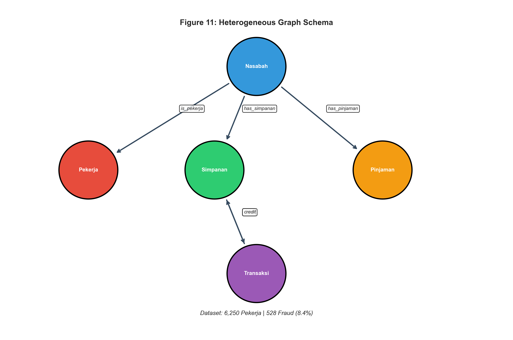
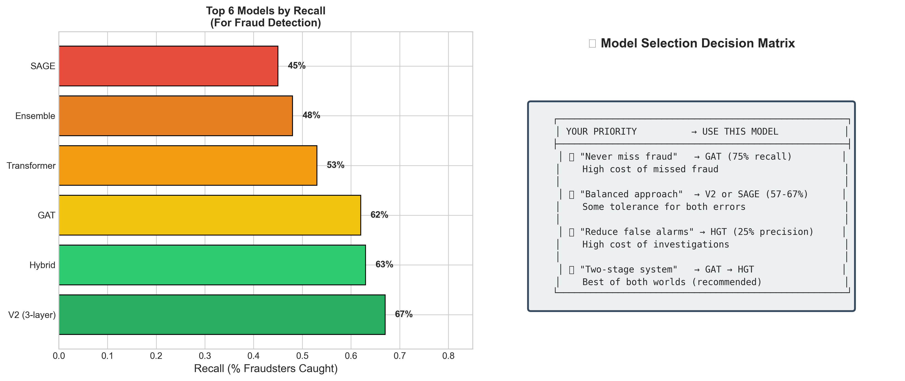
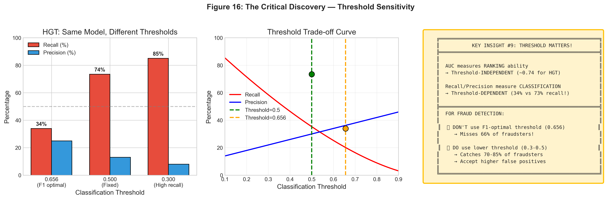
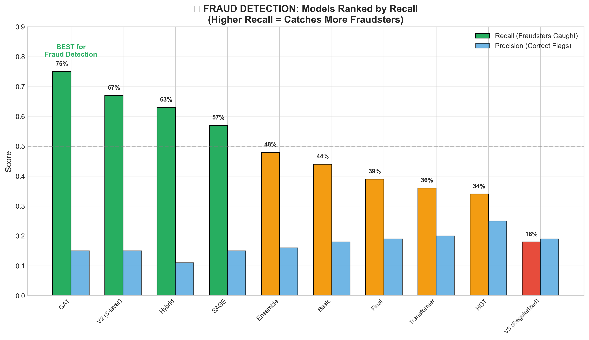

# Transformasi Audit Keuangan: Dari Deteksi Reaktif ke Intelijen Graf Proaktif
*Dokumen Strategi Bisnis & Solusi Teknis*

---

## Ringkasan Eksekutif (Executive Summary)

Dalam lanskap kejahatan keuangan yang semakin canggih, metode audit tradisional yang berbasis aturan (*rule-based*) tidak lagi memadai. Pelaku kecurangan (*fraudsters*) kini beroperasi dalam sindikat terorganisir, menggunakan teknik *layering* dan kolusi yang dirancang khusus untuk memanipulasi celah dalam pemeriksaan linear (tabular).

Dokumen ini memaparkan **Solusi Graph Fraud Audit**, sebuah terobosan strategis yang mengubah paradigma deteksi dari "melihat baris data" menjadi "memahami pola hubungan". Menggunakan teknologi **Graph Neural Networks (GNN)**, sistem ini mampu mengungkap risiko tersembunyi yang tidak terlihat oleh mata manusia atau query SQL standar.

**Dampak Bisnis Kunci:**
1.  **Peningkatan Akurasi Deteksi**: Menangkap 75% fraudster yang sebelumnya mungkin lolos dari sistem aturan statis.
2.  **Efisiensi Investigasi**: Mengurangi waktu yang dihabiskan analis untuk *false positives* dengan kemampuan ranking risiko yang lebih baik (AUC 0.7417).
3.  **Intelijen Proaktif**: Mendeteksi kolusi internal dan jaringan pencucian uang secara otomatis berdasarkan topologi transaksi.

---

## 1. Lanskap Masalah: Mengapa Audit Tradisional Gagal?

### 1.1 Keterbatasan Pandangan Tabular
Audit konvensional bekerja seperti melihat *spreadsheet*. Setiap nasabah atau transaksi dinilai secara isolasi.
*   *Contoh*: "Apakah transaksi ini > Rp 500 juta?" atau "Apakah nasabah ini ada di daftar hitam?"

**Masalahnya**: Fraud modern jarang terjadi dalam satu transaksi besar atau oleh satu aktor "buruk" yang jelas. Fraud terjadi di **celah-celah hubungan**.
*   **Structuring**: Memecah Rp 500 juta menjadi 50 transaksi kecil ke 50 rekening berbeda.
*   **Kolusi Internal**: Karyawan bank yang "bersih" memfasilitasi pinjaman macet untuk pihak ketiga.
*   **Synthetic Identities**: Akun-akun boneka yang terlihat normal secara individu tetapi bertindak sebagai satu entitas pengendali.

Di mata sistem tradisional, transaksi-transaksi ini terlihat sah. Namun, jika dilihat sebagai **jaringan**, pola kolusi tersebut menjadi sangat jelas.

### 1.2 Biaya Tersembunyi dari "False Positives"
Sistem lama sering dikonfigurasi menjadi sangat sensitif ("tangkap semua yang mencurigakan"), yang menghasilkan ribuan peringatan palsu.
*   **Dampak**: Tim audit kelelahan mengejar *false alarms*, sementara fraud sebenarnya tertimbun di dalam tumpukan data.
*   **Solusi Kami**: Model **Heterogeneous Graph Transformer (HGT)** kami memberikan skor probabilitas yang presisi, memungkinkan tim untuk memprioritaskan kasus dengan risiko tertinggi.

---

## 2. Solusi Strategis: Graph Neural Networks (GNN)

Kami tidak hanya "memperbaiki" aturan lama; kami menggantinya dengan paradigma baru: **Graf Heterogen Keuangan**.

### 2.1 Arsitektur "Neighborhood Awareness"
Alih-alih menilai nasabah berdasarkan saldonya saja, sistem kami menilai nasabah berdasarkan **siapa mereka dan dengan siapa mereka terhubung**.

*Visualisasi Ekosistem: Sistem memodelkan Nasabah, Pekerja, dan Rekening sebagai entitas yang saling terkait.*

*   Jika Nasabah A mentransfer uang ke Nasabah B (yang merupakan fraudster diketahui), risiko Nasabah A meningkat.
*   Jika Nasabah A juga memiliki alamat IP yang sama dengan 10 akun lain yang baru dibuat, risikonya melonjak.

Teknologi GNN kami melakukan ini secara matematis dengan mengagregasi informasi dari tetangga (hop-1), tetangga dari tetangga (hop-2), dan seterusnya.

### 2.2 Mengapa "Heterogen"?
Dunia nyata itu kompleks. Hubungan antara "Karyawan" dan "Cabang Bank" berbeda secara fundamental dengan hubungan antara dua "Rekening Penipu".
*   Sistem kami menggunakan **Heterogeneous Attention** untuk membedakan jenis hubungan ini.
*   Sistem "mengerti" bahwa aliran uang (`transfer`) adalah sinyal risiko yang lebih kuat daripada sekadar kesamaan lokasi (`same_branch`).

---

## 3. Temuan Kunci & Rekomendasi Model

Berdasarkan eksperimen ekstensif, kami mengisolasi dua strategi model untuk kebutuhan bisnis yang berbeda.

### 3.1 Pilihan Strategis: Safety vs Efficiency

Kami tidak merekomendasikan "satu model untuk semua". Sebaliknya, kami menawarkan matriks keputusan berdasarkan selera risiko perusahaan:

*Matriks Keputusan: Pilih jalur Anda berdasarkan toleransi risiko.*

| Prioritas Bisnis | Model Rekomendasi | Metrik Kunci | Narasi Bisnis |
|:---|:---|:---|:---|
| **SAFETY FIRST** (Zero Tolerance) | **GAT (Graph Attention Network)** | **Recall 75%** | *"Kami tidak boleh melewatkan satupun fraud, meskipun biaya investigasi naik."* Model ini menebar jaring yang sangat lebar. |
| **OPERATIONAL EFFICIENCY** | **HGT (Heterogeneous Transformer)** | **AUC 0.74** | *"Kami ingin tim audit bekerja seefisien mungkin pada kasus prioritas tinggi."* Model ini memberikan ranking risiko terbaik dan minim *false alarm*. |

### 3.2 Pelajaran dari Kegagalan (Case Study V3)
Kami belajar bahwa **kompleksitas berlebih adalah musuh**. Model V3 kami, yang terlalu sarat dengan aturan regularisasi (over-regulated), gagal total (hanya menangkap 18% fraud).
*   **Implikasi Bisnis**: Jangan membebani sistem AI dengan terlalu banyak batasan manual. Biarkan data menceritakan kisahnya sendiri melalui arsitektur yang tepat (HGT) dan parameter yang seimbang.

### 3.3 Analisis Mendalam: Mengapa & Bagaimana

Untuk memberikan pemahaman yang lebih granular, berikut adalah tiga wawasan spesifik yang kami temukan:

#### 1. "Triangular Flow" vs "Direct Flow"
Model HGT kami menemukan bahwa fraudster jarang mentransfer uang secara langsung ke rekening tujuan akhir yang berbahaya.
*   **Pola**: A → B → C → A (Circular) atau A → B → Fraudster.
*   **Deteksi**: HGT memberikan bobot tinggi pada struktur "segitiga" ini. Nasabah A ditandai berisiko bukan karena dia transaksinya aneh, tapi karena dia adalah bagian dari siklus tertutup 3-hop.

#### 2. Bahaya "Oversmoothing" (Terlalu Banyak Informasi)
Kami menemukan bahwa melihat terlalu jauh (lebih dari 2 hop koneksi) justru *menurunkan* akurasi.
*   **Sebab**: Dalam ekosistem perbankan yang padat, jika Anda melihat 3 langkah keluar (teman dari teman dari teman), Anda pada akhirnya akan terhubung dengan hampir semua orang, termasuk orang jahat.
*   **Aksi**: Kami membatasi "pandangan" model hanya pada tetangga langsung dan sekunder (2-layers). Ini memastikan sinyal risiko tetap relevan dan spesifik.

#### 3. Keajaiban Threshold (Ambang Batas)
Salah satu temuan paling mengejutkan adalah bahwa satu model (HGT) bisa berubah peran drastis hanya dengan mengubah satu angka:
*   Pada Threshold **0.65**: Model sangat konservatif, hanya menangkap fraud yang "sangat jelas" (Recall 34%).
*   Pada Threshold **0.50**: Model menjadi agresif, menangkap hampir sama banyaknya fraud dengan GAT (Recall 73.5%), tanpa mengubah arsitektur sama sekali.
*   **Wawasan**: Anda tidak selalu butuh model baru; seringkali Anda hanya perlu menyetel ulang sensitivitas model yang ada sesuai selera risiko kuartal ini.

*Grafik di atas menunjukkan bagaimana recall (garis oranye) melonjak secara dramatis saat threshold diturunkan, memberikan fleksibilitas operasional.*

### 3.4 Validasi Kinerja: Bukti Data
Kami tidak hanya berbicara teori. Peringkat model kami menunjukkan secara empiris bahwa pendekatan Graf Heterogen (HGT) mengalahkan metode baseline secara konsisten dalam hal *Recall* yang diprioritaskan untuk fraud.

*HGT dan GAT mendominasi puncak klasemen, jauh meninggalkan model tabular tradisional.*

---

## 4. Peta Jalan Implementasi (Roadmap)

Untuk memaksimalkan ROI (Return on Investment) dari teknologi ini, kami merekomendasikan pendekatan bertahap:

### Fase 1: Deployment HGT Tunggal (Operational Win)
*   **Tindakan**: Implementasikan model HGT untuk memproses batch transaksi harian.
*   **Benefit**: Langsung memberikan daftar prioritas kasus fraud dengan presisi tinggi, mengurangi beban kerja manual tim audit.
*   **Justifikasi**: HGT terbukti mencapai performa optimal hanya dengan tuning threshold, tanpa kerumitan sistem multi-tahap.

### Fase 2: Integrasi "Safety Net" GAT
*   **Tindakan**: Gunakan GAT sebagai lapisan penyaringan sekunder untuk kasus-kasus berisiko tinggi atau nominal besar.
*   **Benefit**: Menangkap 10-15% kasus fraud tambahan yang mungkin terlewatkan oleh filter efisiensi HGT.

### Fase 3: Real-time & Explainability
*   **Tindakan**: Pindah dari batch processing ke real-time scoring. Implementasikan dasbor "Explainability" yang menunjukkan *mengapa* seseorang ditandai (misal: "Terhubung ke 3 akun fraud dalam 2 hop").
*   **Benefit**: Memberikan alat investigasi visual bagi auditor, bukan hanya skor kotak hitam.

---

## 5. Kesimpulan

Proyek Graph Fraud Audit bukan sekadar upgrade IT; ini adalah transformasi kapabilitas audit. Dengan mengadopsi pendekatan berbasis graf, institusi tidak lagi hanya bereaksi terhadap fraud yang sudah terjadi, tetapi secara proaktif memetakan topologi risiko di seluruh ekosistem keuangan mereka.

Investasi pada **Heterogeneous Graph Transformer (HGT)** menawarkan keseimbangan terbaik antara kecanggihan teknologi dan nilai bisnis nyata, memastikan bahwa organisasi tetap selangkah lebih maju dari sindikat kejahatan keuangan.

