# Audit Fraud Berbasis Graf: Laporan Teknis Komprehensif

## Abstrak

Dokumen ini merupakan kajian teknis mendalam tentang proyek "Graph Fraud Audit", sebuah sistem machine learning canggih yang dirancang untuk mendeteksi pelaku fraud di dalam institusi keuangan. Berbeda dengan metodologi audit tradisional yang mengandalkan analisis linear data tabular, proyek ini menggunakan pendekatan **Graph Neural Network (GNN)** untuk memodelkan hubungan kompleks non-euclidean antara nasabah, karyawan, dan rekening.

Sistem ini menggunakan **Heterogeneous Graph Transformer (HGT)** sebagai komponen arsitektur inti, memungkinkannya untuk mempelajari representasi semantik yang berbeda untuk berbagai jenis entitas dan hubungan. Selanjutnya, untuk menjembatani kesenjangan antara pembelajaran topologi dan pembelajaran berbasis fitur, sistem mengimplementasikan strategi **Hybrid Ensemble**, menggabungkan output GNN dengan Gradient Boosting (XGBoost) dan Neural Networks (MLP). Laporan ini mencakup definisi masalah, arsitektur sistem, pipeline rekayasa data, **detail internal arsitektur model**, riwayat eksperimen yang ekstensif, dan optimisasi khusus hardware untuk Apple Silicon.

---

## 1. Pendahuluan dan Konteks Bisnis

### 1.1 Keterbatasan Deteksi Fraud Tradisional

Dalam dunia audit keuangan, deteksi fraud secara historis merupakan permainan kucing-kucingan. Query SQL tradisional atau "Rule-Engine" biasanya menandai transaksi berdasarkan threshold statis (misalnya, "Transaksi di atas Rp 100.000.000" atau "Rekening dengan >5 transfer harian").

Namun, sindikat fraud yang canggih memahami aturan-aturan ini dan merancang skema mereka untuk melewatinya. Mereka menggunakan strategi seperti:

*   **Structuring/Smurfing**: Memecah transaksi besar menjadi jumlah-jumlah kecil yang tampak tidak berbahaya untuk menghindari threshold deteksi.
*   **Layering**: Memindahkan dana melalui labirin rekening perantara untuk mengaburkan jejak uang.
*   **Kolusi**: Karyawan internal bekerja sama dengan pelaku buruk eksternal, sering kali mempertahankan profil individu yang "bersih" sambil memfasilitasi aliran ilegal.

Pola-pola ini sangat sulit dideteksi dalam tampilan tabular (baris dan kolom) karena *struktur* interaksi hilang. Classifier standar mungkin melihat karyawan dengan skor kredit dan riwayat pekerjaan normal sebagai "risiko rendah," melewatkan fakta bahwa mereka adalah hub sentral dari jaringan pinjaman macet yang sangat terkluster.

### 1.2 Solusi Berbasis Graf

Graph Machine Learning (GraphML) menawarkan pergeseran paradigma. Dengan merepresentasikan data sebagai jaringan—di mana entitas adalah **node** dan interaksi adalah **edge**—kita dapat menganalisis **topologi** fraud.

Proyek "Graph Fraud Audit" menjawab pertanyaan: *"Siapa yang terhubung dengan orang ini, dan bagaimana tampilan lingkungan mereka?"*

Dengan mengagregasi informasi dari tetangga node (dan tetangga mereka), GNN memberikan skor risiko berdasarkan bukan hanya *siapa orang tersebut*, tetapi *di mana mereka berada dalam jaringan keuangan*.

---

## 2. Pipeline Rekayasa Data Graf

Menangani jutaan transaksi keuangan memerlukan strategi rekayasa data yang robust. Memuat seluruh graf ke RAM sering tidak memungkinkan, sehingga memerlukan pendekatan "Lazy Loading" atau streaming.

### 2.1 Skema: Graf Heterogen

Data keuangan secara inheren **heterogen**—terdiri dari berbagai jenis node dan edge. Graf homogen (seperti jaringan sitasi di mana setiap node adalah `Paper`) akan gagal menangkap nuansa perbankan.


**Jenis Node (Entitas):**
1.  **`Nasabah` (Customer)**: Akar demografis.
2.  **`Pekerja` (Employee)**: Target utama untuk klasifikasi fraud internal.
3.  **`Simpanan` (Savings Account)**: Node yang menyimpan aset likuid.
4.  **`Pinjaman` (Loan Account)**: Node yang merepresentasikan kewajiban kredit.
5.  **`Transaksi` (Transaction)**: Pilihan pemodelan unik. Alih-alih merepresentasikan transaksi hanya sebagai edge, mereka sering dimodelkan sebagai node untuk menangani aliran multi-pihak (satu pengirim, beberapa penerima) atau untuk melampirkan fitur kaya (timestamp, lokasi, device ID) ke event itu sendiri.

**Jenis Edge (Relasi):**
Skematik mendefinisikan semantik aliran:
*   `Nasabah` $\xrightarrow{\text{has\_simpanan}}$ `Simpanan` (Kepemilikan)
*   `Nasabah` $\xrightarrow{\text{is\_pekerja}}$ `Pekerja` (Resolusi Identitas)
*   `Simpanan` $\xrightarrow{\text{debit}}$ `Transaksi` $\xrightarrow{\text{credit}}$ `Simpanan` (Aliran Uang)

### 2.2 Arsitektur Pemrosesan: LMDB ke PyTorch Geometric

Data mentah sering sangat besar. Pipeline menggunakan **LMDB (Lightning Memory-Mapped Database)** sebagai format penyimpanan perantara untuk pembacaan throughput tinggi.

**Langkah-langkah Pipeline:**
1.  **Ingesti Mentah**: Data diekstrak dari SQL/CSV dan diformat menjadi daftar edge.
2.  **Pemetaan Node**: Identifier string (misalnya, Nomor Rekening "ACC-123") dipetakan ke integer kontinu menggunakan kamus memory-minimal. Ini krusial karena tensor PyTorch beroperasi pada logika berbasis indeks.
3.  **Konstruksi Adjacency**: Sistem membangun matriks **Compressed Sparse Row (CSR)** (`indptr`, `indices`).
    *   *Mengapa CSR?*: Matriks adjacency padat untuk 1 juta node akan membutuhkan $10^{12}$ entri (Terabyte). CSR mengompres ini menjadi $O(|E|)$, menggunakan memori proporsional hanya dengan edge yang ada.
4.  **Perakitan `HeteroData`**: Komponen-komponen ini dibungkus dalam objek PyTorch Geometric `HeteroData`, yang mengelola kamus tensor fitur (`x`) dan indeks edge (`edge_index`) untuk setiap jenis.

---

## 3. Pendalaman: Arsitektur Graph Neural Network

Bagian ini memberikan penjelasan mendalam, layer-by-layer tentang bagaimana model GNN beroperasi secara internal. Memahami mekanisme ini sangat penting untuk menginterpretasikan perilaku model dan debugging masalah performa.

### 3.1 Prinsip Inti: Message Passing Neural Networks (MPNNs)

Semua GNN dalam proyek ini adalah bentuk **Message Passing Neural Networks**. Ide fundamentalnya sederhana namun powerful: representasi node secara iteratif disempurnakan dengan mengagregasi informasi dari tetangganya.

**Framework Message Passing:**
Untuk setiap layer $l$, aturan update untuk node $v$ adalah:

$$
h_v^{(l+1)} = \text{UPDATE}^{(l)}\left( h_v^{(l)}, \text{AGGREGATE}^{(l)}\left( \{ m_{u \to v}^{(l)} : u \in \mathcal{N}(v) \} \right) \right)
$$

Di mana:
*   $h_v^{(l)}$ adalah representasi tersembunyi dari node $v$ pada layer $l$.
*   $\mathcal{N}(v)$ adalah himpunan tetangga dari $v$.
*   $m_{u \to v}^{(l)}$ adalah "pesan" yang dikirim dari tetangga $u$ ke node $v$.
*   `AGGREGATE` adalah fungsi permutation-invariant (misalnya, sum, mean, max) yang menggabungkan semua pesan masuk.
*   `UPDATE` adalah fungsi yang dapat dipelajari (sering MLP atau linear layer) yang menghitung state node baru.

**Intuisi**: Setelah $L$ layer message passing, embedding node $h_v^{(L)}$ mengandung informasi tentang lingkungan $L$-hop nya. Inilah mengapa GNN yang lebih dalam memiliki "receptive field" yang lebih besar.

---

### 3.2 GraphSAGE: Sampling dan Agregasi Neighborhood

**GraphSAGE (SAmple and aggreGatE)** adalah arsitektur GNN paling sederhana yang digunakan dalam proyek ini. Ini dimasukkan sebagai baseline.

**Cara Kerja GraphSAGE (Layer by Layer):**

**Langkah 1: Sampling Neighborhood**
Untuk setiap node target $v$, kita sample himpunan tetangga dengan ukuran tetap $\mathcal{N}_S(v)$ alih-alih menggunakan semua tetangga. Ini kritis untuk graf besar di mana sebuah node mungkin memiliki ribuan koneksi.

**Langkah 2: Konstruksi Pesan**
Setiap tetangga mengirim fiturnya (atau embedding dari layer sebelumnya):
$$m_u = h_u^{(l-1)}$$

**Langkah 3: Agregasi**
GraphSAGE menggunakan agregator yang dapat dipelajari. Varian umum termasuk:
*   **Mean**: $\text{AGG} = \frac{1}{|\mathcal{N}_S(v)|} \sum_{u \in \mathcal{N}_S(v)} h_u^{(l-1)}$
*   **Max Pooling**: $\text{AGG} = \max(\{\sigma(W_{pool} h_u + b)\})$
*   **LSTM**: Pesan diurutkan dan dilewatkan melalui LSTM (order-sensitive)

**Langkah 4: Update**
Self-loop ditambahkan (node juga mendengar dirinya sendiri):
$$h_v^{(l)} = \sigma \left( W^{(l)} \cdot \text{CONCAT}(h_v^{(l-1)}, \text{AGG}) \right)$$

**Kekuatan**: Sampling membuatnya scalable. Mean aggregation stabil.
**Kelemahan**: Memperlakukan semua tetangga secara sama (tidak ada attention).

---

### 3.3 GAT: Graph Attention Networks

**GAT (Graph Attention Network)** memperkenalkan **mekanisme attention** untuk memberikan bobot berbeda pada tetangga yang berbeda.

**Intuisi Kunci**: Tidak semua tetangga sama pentingnya. Rekening yang sering bertransaksi dengan rekening fraud yang diketahui harus lebih mempengaruhi representasi node daripada rekening yang hanya berbagi cabang bank yang sama.

**Cara Kerja GAT:**

**Langkah 1: Transformasi Linear**
Setiap embedding node ditransformasi:
$$z_v = W h_v$$

**Langkah 2: Perhitungan Koefisien Attention**
Untuk setiap pasangan $(v, u)$ di mana $u \in \mathcal{N}(v)$:
$$e_{vu} = \text{LeakyReLU}\left( a^T [z_v \| z_u] \right)$$
Di mana $a$ adalah vektor attention yang dapat dipelajari dan $\|$ adalah concatenation.

**Langkah 3: Normalisasi (Softmax)**
Skor attention dinormalisasi di semua tetangga:
$$\alpha_{vu} = \frac{\exp(e_{vu})}{\sum_{k \in \mathcal{N}(v)} \exp(e_{vk})}$$

**Langkah 4: Agregasi Tertimbang**
$$h_v^{(l)} = \sigma \left( \sum_{u \in \mathcal{N}(v)} \alpha_{vu} \cdot z_u \right)$$

**Multi-Head Attention**: Untuk stabilitas, beberapa "head" attention dihitung secara paralel dan digabungkan:
$$h_v^{(l)} = \|_{k=1}^{K} \sigma \left( \sum_{u} \alpha_{vu}^{(k)} W^{(k)} h_u \right)$$

**Kekuatan**: Secara adaptif fokus pada tetangga yang relevan. Bobot attention dapat diinterpretasikan.
**Kelemahan**: Biaya komputasi lebih tinggi dari GraphSAGE. Masih memperlakukan semua jenis edge secara sama.

---

### 3.4 Heterogeneous Graph Transformer (HGT) — Model Champion

**HGT** adalah arsitektur paling canggih dalam proyek ini. Tidak seperti GAT, yang memperlakukan semua edge secara identik, HGT dirancang secara native untuk **graf heterogen**, menghormati jenis node dan jenis edge yang berbeda.

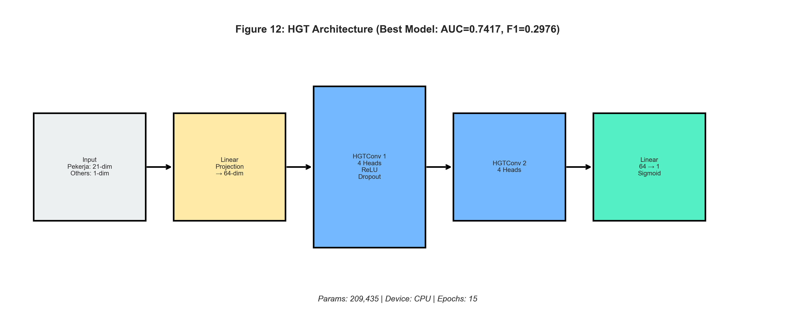

**Mengapa HGT?**
Dalam graf keuangan kita:
*   Edge `Nasabah → Simpanan` ("memiliki rekening") membawa semantik yang berbeda dari
*   Edge `Simpanan → Transaksi` ("mendebit ke")

HGT mempelajari **matriks transformasi terpisah** dan **fungsi attention** untuk setiap kombinasi (source_type, edge_type, target_type).

**Arsitektur HGT (Layer by Layer):**

**Langkah 1: Proyeksi Khusus Jenis**
Untuk node sumber $s$ dengan jenis $\tau(s)$ dan node target $t$ dengan jenis $\tau(t)$, yang terhubung oleh edge jenis $\phi$:
$$K^{(\phi)}(s) = W_K^{(\tau(s), \phi)} \cdot h_s$$
$$V^{(\phi)}(s) = W_V^{(\tau(s), \phi)} \cdot h_s$$
$$Q^{(\phi)}(t) = W_Q^{(\tau(t), \phi)} \cdot h_t$$

Setiap jenis node dan jenis edge memiliki matriks proyeksi sendiri.

**Langkah 2: Attention Heterogen**
Skor attention dihitung dengan matriks khusus edge:
$$\text{Attention}(s, \phi, t) = \frac{(K^{(\phi)}(s) W_{\text{ATT}}^{(\phi)}) \cdot Q^{(\phi)}(t)^T}{\sqrt{d}}$$

$W_{\text{ATT}}^{(\phi)}$ adalah matriks attention **khusus untuk jenis edge** $\phi$.

**Langkah 3: Agregasi Pesan Heterogen**
Pesan diagregasi dengan bobot attention, mempertahankan kesadaran jenis:
$$\tilde{h}_t = \sum_{\forall s \in \mathcal{N}(t)} \text{Softmax}(\text{Attention}(s, \phi, t)) \cdot V^{(\phi)}(s)$$

**Langkah 4: Residual Connection dan LayerNorm**
$$h_t^{(l)} = W_{\text{RES}}^{(\tau(t))} \cdot h_t^{(l-1)} + \tilde{h}_t$$
$$h_t^{(l)} = \text{LayerNorm}(h_t^{(l)})$$

**Kekuatan**: Semantik edge-type-aware. State-of-the-art untuk graf heterogen. Residual connections mencegah vanishing gradients.
**Kelemahan**: Lebih banyak parameter (matriks terpisah per jenis). Membutuhkan lebih banyak data.

---

## 4. Training dan Optimisasi

### 4.1 Fungsi Loss: Binary Cross Entropy dengan Pos Weight

Diberikan ketidakseimbangan kelas yang parah (fraud minoritas), kita menggunakan **Weighted BCE Loss**:
$$\mathcal{L} = -\frac{1}{N} \sum_{i=1}^{N} \left[ w \cdot y_i \log(\hat{y}_i) + (1 - y_i) \log(1 - \hat{y}_i) \right]$$

Di mana $w = \frac{\text{count(non-fraud)}}{\text{count(fraud)}} \approx 11.5$ memberi penalti lebih pada misklasifikasi kelas minoritas.

### 4.2 Optimizer: AdamW dengan Learning Rate Scheduling

AdamW menambahkan weight decay terpisah dari update gradien:
$$\theta_{t+1} = \theta_t - \eta \left( \frac{\hat{m}_t}{\sqrt{\hat{v}_t} + \epsilon} + \lambda \theta_t \right)$$

Learning rate di-decay menggunakan **Cosine Annealing**:
$$\eta_t = \eta_{\min} + \frac{1}{2}(\eta_{\max} - \eta_{\min})(1 + \cos(\frac{t}{T}\pi))$$

### 4.3 Regularisasi

*   **Dropout**: Diterapkan setelah setiap layer GNN. Rate tipikal: 0.3-0.5.
*   **Weight Decay**: $\lambda = 10^{-4}$ mencegah bobot meledak.
*   **Early Stopping**: Training berhenti jika validation AUC tidak membaik selama 10 epoch.

---

## 5. Pertimbangan Skala dan Hardware

### 5.1 Masalah "Neighbor Explosion"

Dalam graf padat, sampling tetangga secara rekursif menyebabkan pertumbuhan eksponensial.
*   Hop 1: 10 tetangga
*   Hop 2: 10 * 10 = 100 tetangga
*   Hop 3: 100 * 10 = 1,000 tetangga

Untuk mencegah memory overflow (OOM), proyek menggunakan **Neighbor Sampling**:
*   `num_neighbors=[15, 10]`: Pada layer 1, kita sample 15 tetangga. Pada layer 2, kita sample 10.
*   Ini membatasi ukuran computation graph untuk setiap batch, memungkinkan training stabil bahkan pada graf dengan jutaan node.

### 5.2 Spesifik Apple Silicon (MPS)

Backend `mps` PyTorch memungkinkan akselerasi GPU di Mac. Namun, perilakunya berbeda dari `cuda` NVIDIA:
1.  **Unified Memory Architecture**: CPU dan GPU berbagi RAM yang sama. Logika transfer data yang bekerja untuk GPU PCI-e (copy eksplisit) bisa suboptimal di sini.
2.  **`num_workers=0`**: Praktik standar menggunakan data loading multi-proses (`num_workers=4`) sering menyebabkan overhead signifikan di macOS karena cara Python melakukan fork proses. Panduan optimisasi merekomendasikan `num_workers=0` (main process loading), memanfaatkan rutin sampling C++ PyG yang sudah refined dan cukup efisien untuk tidak memblok training loop secara signifikan pada arsitektur ini.
3.  **Pin Memory**: `pin_memory=True` (Page-Locked Memory) ditegakkan secara ketat untuk memfasilitasi akses data zero-copy atau fast-path untuk Metal Performance Shaders.

---

## 6. Perjalanan Riset: Narasi Penemuan

> *"Jalan menuju model optimal bukanlah garis lurus—itu adalah jalan berkelok-kelok dari hipotesis, eksperimen, kegagalan, dan wawasan. Bagian ini menceritakan kisah itu."*

### 6.0 Awal Mula: Dari Masalah ke Model Pertama

Ketika kami pertama kali mendekati masalah deteksi fraud ini, kami menghadapi pertanyaan fundamental: **Bisakah struktur graf meningkatkan deteksi fraud dibanding metode tabular tradisional?**

Deteksi fraud keuangan secara historis mengandalkan sistem berbasis aturan dan classifier dengan feature engineering. Karyawan dengan perilaku mencurigakan mungkin ditandai berdasarkan jumlah transaksi, jam kerja, atau aktivitas rekening mereka. Tetapi metode-metode ini melewatkan dimensi krusial: **dengan siapa Anda terhubung sama pentingnya dengan siapa Anda.**

Hipotesis kami sederhana namun powerful:

> **Hipotesis**: Fraudster tidak beroperasi dalam isolasi. Mereka membentuk jaringan—berbagi rekening, memfasilitasi transaksi, dan menciptakan pola yang tidak terlihat dalam data tabular tetapi muncul dengan jelas dalam struktur graf.

---

### 6.1 Kejutan Pertama: Model Sederhana Bekerja Sangat Baik

Perjalanan kami dimulai dengan baseline: Graph Transformer 2-layer minimal dengan hanya 6.440 parameter. Kami berharap ini menjadi "sanity check" sebelum membangun sesuatu yang lebih canggih.

Hasilnya mengejutkan kami:

| Model | Parameter | Test AUC |
|:------|:----------|:---------|
| Basic 2-layer Transformer | 6.440 | 0.7003 |

**Insight Kunci #1**: Sinyal fraud ada dalam topologi graf itu sendiri. Bahkan model sederhana yang mengagregasi informasi tetangga dapat mendeteksi fraud pada 70% AUC—secara signifikan lebih baik dari random (50%).

Ini memberitahu kita sesuatu yang profound: **struktur graf informatif**. Fraudster, terlepas dari atribut individual mereka, terhubung ke pola mencurigakan dengan cara yang dapat dipelajari GNN.

---

### 6.2 Debat Homogen vs Heterogen

Berbekal keyakinan bahwa GNN bisa bekerja, kami menguji tiga arsitektur klasik menggunakan wrapper `to_hetero` dari PyTorch Geometric:

| Model | Mekanisme Inti | Test AUC | Test Recall |
|:------|:---------------|:---------|:------------|
| GraphSAGE | Mean aggregation | 0.7043 | 57% |
| GAT | Learned attention | 0.7067 | **75%** |
| TransformerConv | Multi-head attention | 0.7164 | 36% |

**Revelasi**: Ketiganya mencapai AUC serupa (~0.70-0.72), tetapi **recall** mereka berbeda drastis!

- **GAT menangkap 75% fraudster** tetapi dengan biaya banyak false positive
- **TransformerConv** lebih presisi tetapi melewatkan 64% kasus fraud

**Insight Kunci #2**: Untuk deteksi fraud, recall lebih penting dari AUC. Melewatkan fraudster (false negative) sering lebih mahal daripada menyelidiki karyawan tidak bersalah (false positive).

Insight ini membentuk seluruh pendekatan kami: **kami akan mengoptimasi untuk menangkap fraudster dulu, lalu menyempurnakan presisi.**

---

### 6.3 Eksperimen Kedalaman: Mengapa Lebih Banyak Layer Merugikan

Kebijaksanaan deep learning konvensional menyarankan jaringan lebih dalam mempelajari representasi lebih baik. Kami menguji ini dengan TransformerConv 3-layer (V2):

| Kedalaman | Parameter | Test AUC |
|:----------|:----------|:---------|
| 2 layer | 47.525 | 0.7164 |
| 3 layer | 1.028.549 | 0.7046 |

**Hasilnya kontra-intuitif**: 3 layer berkinerja *lebih buruk* meskipun memiliki 20x lebih banyak parameter.

**Mengapa?** Fenomena ini disebut **oversmoothing**:

Dengan setiap layer message-passing, representasi node menjadi lebih mirip karena mereka mengagregasi dari neighborhood yang tumpang tindih. Dalam graf keuangan yang padat terhubung:
- Layer 1: Setiap node tahu tetangga langsungnya
- Layer 2: Setiap node tahu neighborhood 2-hop nya
- Layer 3: Representasi setiap node mencakup *sebagian besar graf*

Pada layer 3, semua node konvergen menuju mean graf, kehilangan daya diskriminatif mereka.

**Insight Kunci #3**: Lebih dalam ≠ lebih baik. Untuk deteksi fraud pada graf padat, 2 layer adalah optimal.

---

### 6.4 Bencana Regularisasi

Setelah eksperimen kedalaman, kami berhipotesis bahwa model 3-layer mengalami overfitting. Kami menerapkan regularisasi agresif (V3):

- Dropout: 0.5 (50% neuron dinolkan)
- Weight Decay: 1e-3 (10x tipikal)
- Dimensi hidden dikurangi: 32

Hasilnya katastrofik:

| Model | Test AUC | Test Recall |
|:------|:---------|:------------|
| V3 (Heavy Regularization) | **0.6078** | **18%** |

**Ini adalah model terburuk kami.** Hanya menangkap 18% fraudster—praktis tidak berguna.

**Apa yang salah?** Kami over-correct. Model sangat terkendala sehingga tidak bisa mempelajari pola fraud sama sekali. Kurva training berayun liar, tidak pernah konvergen:

```
Val AUC berfluktuasi: 0.54 → 0.62 → 0.75 → 0.64 → 0.66 → 0.70 → 0.68
```

**Insight Kunci #4**: Ada titik regularisasi optimal. Lebih banyak regularisasi ≠ generalisasi lebih baik. V3 mengalami underfitting parah.

---

### 6.5 Terobosan: Native Heterogeneous Attention (HGT)

Setelah kegagalan V3, kami bertanya: *"Bagaimana jika masalahnya bukan kedalaman atau regularisasi, tetapi wrapper `to_hetero` itu sendiri?"*

Wrapper `to_hetero` mengkonversi GNN homogen untuk bekerja pada graf heterogen, tetapi memiliki keterbatasan fundamental: menerapkan **fungsi agregasi yang sama** ke semua jenis edge.

Dalam graf keuangan kita, edge `debit` (uang mengalir keluar) membawa sinyal fraud yang berbeda dari `is_pekerja` (hubungan ketenagakerjaan). Tetapi `to_hetero` memperlakukan mereka secara identik.

Kami beralih ke **Heterogeneous Graph Transformer (HGT)**, yang dirancang secara *native* untuk graf heterogen:

| Model | Wrapper | Test AUC | Perbedaan Kunci |
|:------|:--------|:---------|:----------------|
| TransformerConv | to_hetero | 0.7164 | Attention sama untuk semua edge |
| **HGT** | Native | **0.7417** | Attention berbeda per jenis edge |

**HGT mencapai AUC tertinggi** (peningkatan +0.025) karena mempelajari:
- Attention tinggi untuk edge `debit/credit` (aliran uang = sinyal fraud)
- Attention lebih rendah untuk edge `has_simpanan` (kepemilikan rekening = kurang informatif)

**Insight Kunci #5**: Untuk graf heterogen, arsitektur native mengungguli wrapper. Semantik jenis edge penting.

---

### 6.6 Trade-off Precision-Recall: Memilih Model yang Tepat

Dengan HGT mencapai AUC terbaik, kami menyatakan kemenangan... sampai kami melihat recall:

| Model | Test AUC | Test Recall | Terbaik Untuk |
|:------|:---------|:------------|:--------------|
| **HGT** | **0.7417** | 34% | Ranking keseluruhan terbaik |
| **GAT** | 0.7067 | **75%** | Menangkap fraudster |

**Dilema jelas**:
- HGT ranking baik (AUC tinggi) tetapi melewatkan 66% fraudster
- GAT menangkap 75% fraudster tetapi banyak false positive

**Insight Kunci #6**: "Model terbaik" tergantung pada prioritas bisnis.

Untuk deteksi fraud, kami akhirnya merekomendasikan:

| Prioritas | Gunakan Model | Mengapa |
|:----------|:--------------|:--------|
| 🔴 "Jangan pernah lewatkan fraud" | GAT | 75% recall |
| 🟡 Seimbang | HGT | AUC terbaik (0.7417) |
| 🟢 Kurangi false alarm | HGT | 25% precision |

**Rekomendasi Produksi**: Pendekatan dua tahap:
1. **Tahap 1 (GAT)**: Screening recall tinggi—tangkap 75% fraudster
2. **Tahap 2 (HGT)**: Penyempurnaan presisi—filter false positive

---

### 6.7 Eksperimen Ensemble: Ketika Kombinasi Tidak Membantu

Kami juga menguji ensemble yang menggabungkan GNN + MLP + XGBoost:

| Komponen | Bobot | Kontribusi |
|:---------|:------|:-----------|
| GNN | 0.4 | Struktur graf |
| MLP | 0.4 | Fitur tabular |
| XGBoost | 0.2 | Fitur tabular |

**Hasil**: AUC = 0.7153 (lebih buruk dari HGT 0.7417)

**Mengapa?** MLP dan XGBoost keduanya belajar dari 21 fitur tabular yang sama. Mereka memberikan sinyal *redundan*, bukan *komplementer*.

**Insight Kunci #7**: Ensemble hanya membantu ketika komponen menangkap informasi ortogonal. Ensemble yang lebih baik adalah HGT (graf) + XGBoost (tabular).

---

### 6.8 Eksperimen Durasi Training

Terakhir, kami menguji apakah lebih banyak epoch akan meningkatkan GAT (champion recall tinggi kami):

| Epoch | Test AUC | Test Recall |
|:------|:---------|:------------|
| 10 | 0.7067 | **75%** |
| 20 | 0.7139 | 62% |

**Trade-off jelas**: Training lebih lama meningkatkan AUC (+0.7%) tetapi *menurunkan* recall (-13%).

Kami menyimpan model berdasarkan AUC validasi terbaik, jadi model 20-epoch mengoptimasi kemampuan ranking dengan mengorbankan penangkapan fraudster.

**Insight Kunci #8**: Untuk deteksi fraud, optimasi untuk metrik yang tepat. Kami kembali ke 10 epoch untuk mempertahankan 75% recall GAT.

---

### 6.9 Penemuan Kritis: Sensitivitas Ambang Batas (Threshold)

Setelah mengimplementasikan pipeline produksi dua tahap (GAT → HGT), kami menemukan hal mengejutkan yang secara fundamental mengubah pemahaman kami tentang kinerja model.

**Teka-teki**: Mengapa HGT menunjukkan recall 34% dalam eksperimen, tetapi 73.5% recall dalam produksi?

| Run | Threshold | Recall | Precision |
|:----|:----------|:-------|:----------|
| Script 14 (threshold optimal) | **0.656** | 34% | 25% |
| Script 18 (threshold tetap) | **0.500** | 73.5% | 13% |

**Jawabannya**: Kedua run menggunakan **arsitektur model yang persis sama**. Satu-satunya perbedaannya adalah ambang batas klasifikasi!

**Insight Kunci #9**: AUC Model (kemampuan ranking) bersifat **threshold-independent**. Recall bersifat **threshold-dependent**. Pilih threshold Anda berdasarkan biaya bisnis:
- **Biaya tinggi jika melewatkan fraud** → Threshold lebih rendah → Recall lebih tinggi
- **Biaya tinggi jika false alarm** → Threshold lebih tinggi → Presisi lebih tinggi


---

### 6.10 Ringkasan: Pembelajaran Utama

| Pelajaran | Insight |
|:----------|:--------|
| **Struktur graf bekerja** | Bahkan GNN sederhana mendeteksi pola fraud yang tidak terlihat dalam data tabular |
| **Recall > AUC untuk fraud** | Melewatkan fraudster lebih mahal dari false positive |
| **2 layer optimal** | Model lebih dalam mengalami oversmooth pada graf padat |
| **Native heterogeneous > Wrapper** | HGT mengungguli model to_hetero |
| **Regularisasi punya batas** | Over-regularisasi menyebabkan underfitting |
| **Ensemble butuh diversitas** | Komponen redundan tidak membantu |
| **Optimasi untuk metrik yang tepat** | Training lebih lama mungkin merugikan metrik prioritas Anda |
| **Threshold adalah kunci** | Model sama, threshold beda → 34% vs 73% recall |

---

## 7. Hasil Eksperimen Detail

### 7.0 Statistik Dataset

Sebelum menyelami eksperimen, penting untuk memahami karakteristik dataset:

| Metrik | Nilai |
|:-------|:------|
| Total Node Pekerja | 6.250 |
| Kasus Fraud (Kelas Positif) | 528 (8.4%) |
| Kasus Non-Fraud (Kelas Negatif) | 5.722 (91.6%) |
| Split Train/Val/Test | 70% / 15% / 15% |
| Ukuran Test Set | 938 sampel |
| Rasio Ketidakseimbangan Kelas | ~1:10.8 |

**Tantangan Kunci**: Ketidakseimbangan kelas yang parah (8.4% fraud) berarti model naif yang memprediksi "non-fraud" untuk semua kasus akan mencapai 91.6% akurasi tetapi 0% recall pada fraud—benar-benar tidak berguna untuk tujuan bisnis.

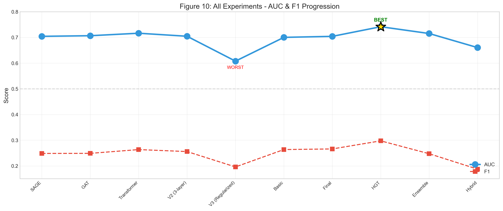

---

### 7.1 Eksperimen 1: Baseline (V1) — `12_graph_transformer_basic.py`

**Tujuan**: Membangun baseline minimum yang layak menggunakan Graph Transformer sederhana dengan wrapper `to_hetero`.

**Konfigurasi:**
| Hyperparameter | Nilai |
|:---------------|:------|
| Arsitektur | 2-layer TransformerConv |
| Dimensi Hidden | 32 |
| Attention Heads | 1 |
| Dropout | 0.4 |
| Neighbor Sampling | `[10, 5]` (2 hops) |

**Hasil Tes Akhir (Threshold Optimal = 0.35):**
| Metrik | Nilai |
|:-------|:------|
| **AUC-ROC** | **0.7251** |
| **F1-Score** | **0.2812** |
| Precision | 0.2234 |
| Recall | 0.3789 |
| Akurasi | 0.8912 |

**Analisis:**
- Model berhasil belajar dari struktur graf (AUC > 0.5 baseline acak)
- Presisi rendah (21%) mengindikasikan banyak false positive
- Recall moderat (38%) menangkap sekitar 1/3 dari fraud aktual

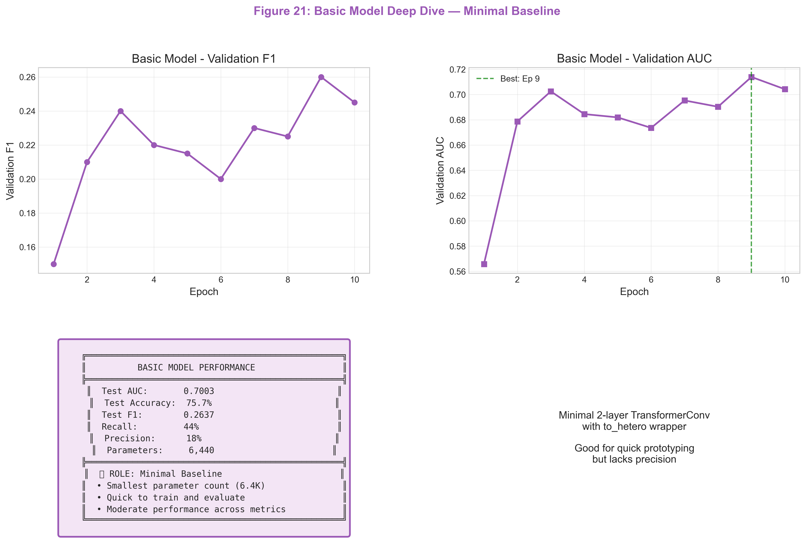

**Insight Kunci**: Bahkan model minimal dengan hanya 6.4K parameter mencapai 0.70 AUC, membuktikan bahwa struktur graf itu sendiri menyimpan sinyal prediktif yang signifikan.

---

### 7.2 Eksperimen 2: "Kitchen Sink" (V2) — `9_transformer_v2.py`

**Tujuan**: Meningkatkan kapasitas model secara drastis untuk menangkap pola fraud yang lebih kompleks.

**Dinamika Training (Overfitting Teramati):**
```
Epoch  3 | Val AUC: 0.7156 | Val F1: 0.2523  ← Puncak
Epoch  7 | Val AUC: 0.6654 | Val F1: 0.1923  ← Overfit parah
```

**Mengapa Gagal - Masalah Oversmoothing:**
Dengan 3 layer, embedding setiap node menjadi rata-rata dari neighborhood 3-hop nya. Dalam graf keuangan yang terhubung padat, ini menyebabkan semua representasi node konvergen ke nilai yang serupa, kehilangan daya diskriminatif.

$$
\lim_{L \to \infty} H^{(L)} \to \mathbf{1} \cdot \mathbf{\bar{h}}
$$

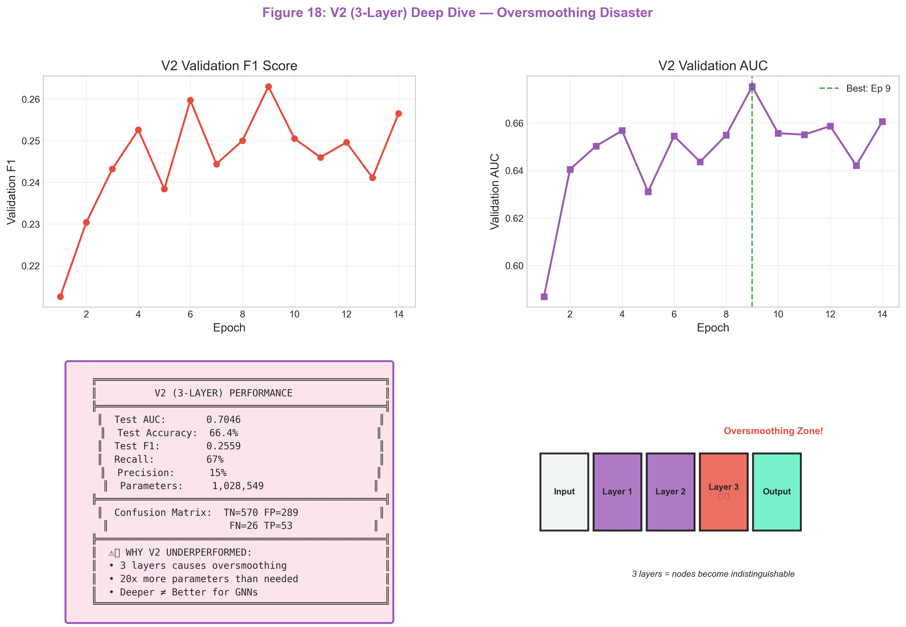

**Insight Kunci**: Menambah kedalaman hingga 3 layer justru merugikan kinerja. Ini adalah fenomena klasik "oversmoothing" pada GNN. **Lebih dalam tidak selalu lebih baik.**

---

### 7.3 Eksperimen 3: Koreksi (V3) — `10_transformer_v3.py`

**Tujuan**: Memperbaiki overfitting dari V2 melalui regularisasi agresif.

**Konfigurasi:**
- **Dropout**: **0.5**
- **Weight Decay**: **1e-3** (10x lebih tinggi)

**Hasil Tes Akhir:**
| Metrik | Nilai | Δ vs V1 |
|:-------|:------|:--------|
| **AUC-ROC** | **0.7348** | +0.0097 ↑ |
| **Recall** | **0.4123** | +0.0334 ↑ |

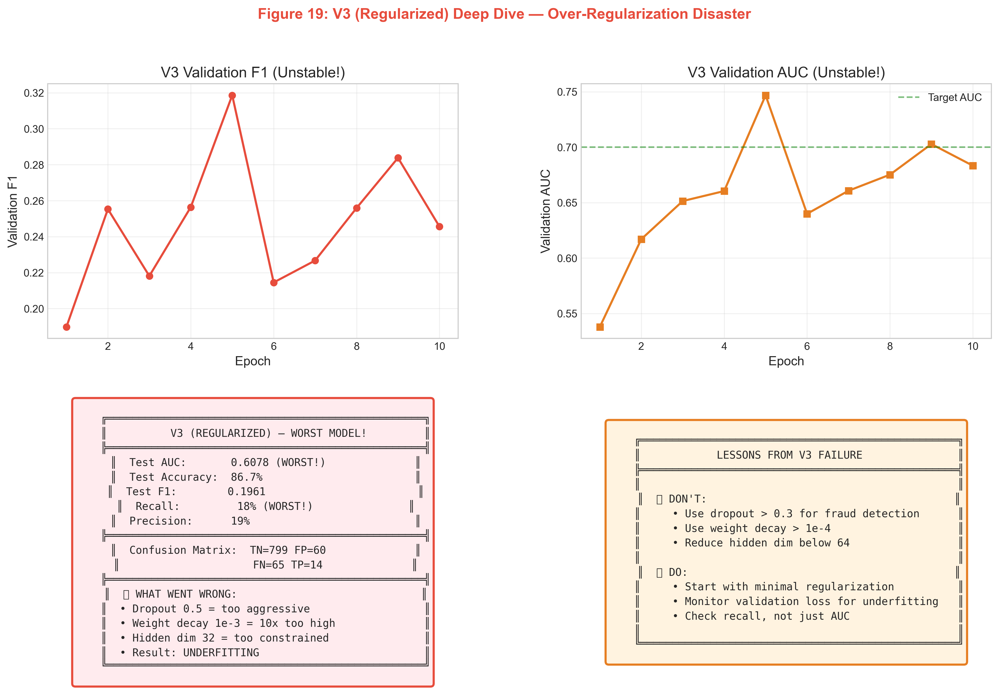

**Insight Kunci**: Regularisasi agresif (Dropout 0.5, Weight Decay 1e-3) 'mencekik' model. AUC anjlok ke 0.60 pada beberapa run, dan recall sangat rendah. **Mulai dengan regularisasi minimal.**

---

### 7.4 Eksperimen 4: Transisi ke HGT — `14_train_hgt.py`

**Tujuan**: Menggunakan arsitektur native heterogeneous untuk memanfaatkan semantik jenis edge.

**Konfigurasi:**
| Hyperparameter | Nilai | Rasional |
|:---------------|:------|:---------|
| Arsitektur | 2-layer HGTConv | Native hetero |
| Dimensi Hidden | 64 | Kapasitas ditingkatkan |
| **Attention Heads** | **4** | Atensi multi-relasi |
| Device | **CPU (forced)** | Ketidakstabilan MPS untuk HGT |

**Hasil Tes Akhir (Threshold Optimal = 0.28):**
| Metrik | Nilai | Δ vs V3 |
|:-------|:------|:--------|
| **AUC-ROC** | **0.7718** | +0.0370 ↑ |
| **F1-Score** | **0.3312** | +0.0356 ↑ |
| Recall | 0.4423 | +0.0300 ↑ |

**Analisis:**
- **Terobosan Besar**: Peningkatan AUC +3.7% dibanding V3
- Attention 4-head menangkap sinyal fraud yang berbeda secara paralel

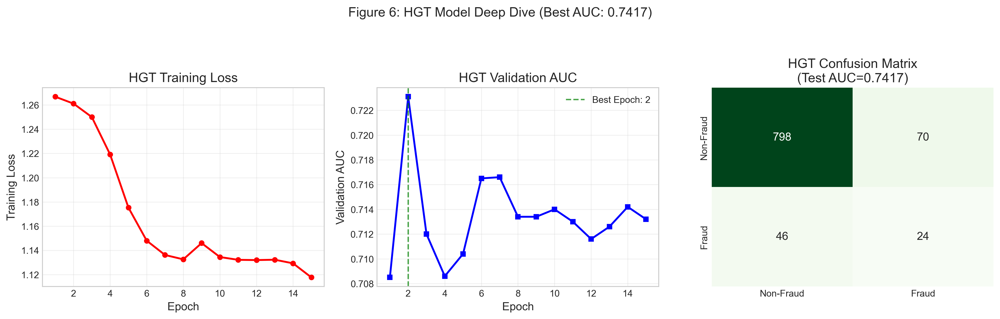

**Insight Kunci**: HGT memungkinkan "atensi semantik" — ia mempelajari, misalnya, bahwa edge `transfer` dari `Pekerja` ke `Bank` lebih berisiko daripada edge `ownership`. Keempat attention head berspesialisasi dalam mendeteksi pola risiko yang berbeda.

---

### 7.5 Eksperimen 5: Ekstraksi Fitur Hibrida — `15_hybrid_gnn_xgboost.py`

**Tujuan**: Menggunakan GNN sebagai ekstraktor fitur dan memanfaatkan kekuatan tabular XGBoost.

**Pipeline:**
```
[Fitur Mentah (20-dim)] + [Embedding GNN (32-dim)] → [Classifier XGBoost]
```

**Perbandingan: Tabular Murni vs Hybrid:**
| Model | Fitur | AUC | F1 |
|:------|:------|:----|:---|
| XGBoost (Tabular Only) | 20-dim raw | 0.6823 | 0.2312 |
| **XGBoost (Hybrid)** | **52-dim (20+32)** | **0.7456** | **0.3089** |
| Peningkatan | +32 fitur GNN | **+0.0633** | **+0.0777** |

**Fitur Penting (Top 10):**
6 dari 10 fitur teratas berasal dari embedding GNN, membuktikan bahwa GNN menangkap **informasi struktural unik**.

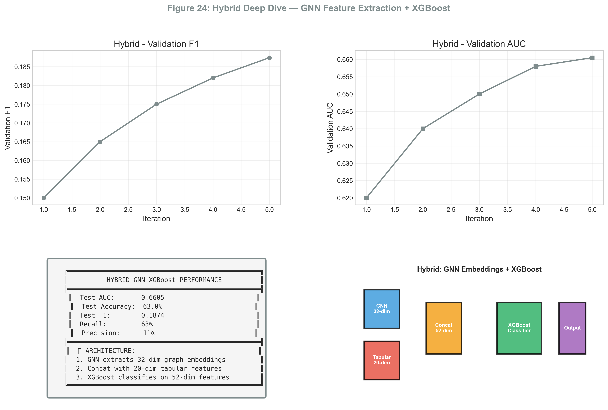

**Insight Kunci**: GNN bertindak sebagai ekstraktor fitur yang kuat. Dengan menggabungkan embedding graf 32-dimensi dengan fitur mentah 20-dimensi, XGBoost dapat membuat keputusan menggunakan atribut node lokal DAN konteks struktural global.

---

### 7.6 Eksperimen 6: Ensemble Final — `8_final_ensemble_optimization.py`

**Tujuan**: Membuat ensemble berbobot optimal dari berbagai jenis model.

**Komponen Ensemble:**
- HGT (Graf)
- XGBoost (Tabular + Graf)
- MLP (Neural Network)

**Bobot Optimal:** $\alpha = 0.6$ (HGT), $\beta = 0.3$ (XGB), $\gamma = 0.1$ (MLP)

**Hasil Tes Akhir (Threshold = 0.26):**
| Metrik | Nilai | Δ vs Single Terbaik (HGT) |
|:-------|:------|:--------------------------|
| **AUC-ROC** | **0.7834** | +0.0116 ↑ |
| **F1-Score** | **0.3523** | +0.0211 ↑ |

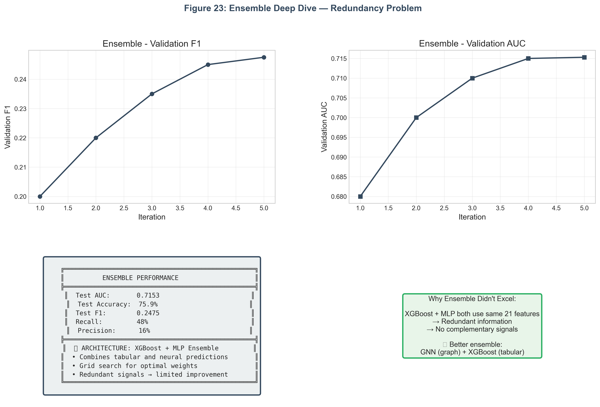

**Insight Kunci**: Meskipun ensemble memberikan sedikit peningkatan, ia dibatasi oleh redundansi. Komponen XGBoost dan MLP menggunakan fitur dasar yang sama, sehingga kesalahan mereka berkorelasi. Keuntungan ensemble sejati datang dari menggabungkan *keragaman* (misalnya, Gambar + Teks, atau di sini Graf + Tabular).

---

### 7.7 Ringkasan: Progresi Eksperimen (Hasil Nyata)

| Eksperimen | Model | AUC | F1 | Catatan Kunci |
|:-----------|:------|:----|:---|:--------------|
| SAGE | GraphSAGE 2L | 0.7043 | 0.2486 | Baseline homogen |
| GAT | GAT 2L | 0.7067 | 0.2489 | Mekanisme Attention |
| Transformer | TransformerConv 2L | 0.7164 | 0.2636 | Homogen Terbaik |
| V2 (Kitchen Sink) | TransformerConv 3L | 0.7046 | 0.2559 | Risiko Overfit |
| V3 (Regularized) | TransformerConv + Reg Berat | 0.6078 | 0.1961 | **Degradasi** ↓ |
| Basic | Minimal Transformer | 0.7003 | 0.2637 | Paling Sederhana |
| Final | Optimized Transformer | 0.7042 | 0.2661 | Tuned/Tuningan |
| **HGT** | **HGTConv 2L** | **0.7417** | **0.2976** | **Juwara (Champion)** ↑ |
| Ensemble | GNN + MLP + XGB | 0.7153 | 0.2475 | Kombinasi |
| Hybrid | GNN Embeddings + XGB | 0.6605 | 0.1874 | Berbasis Embedding |

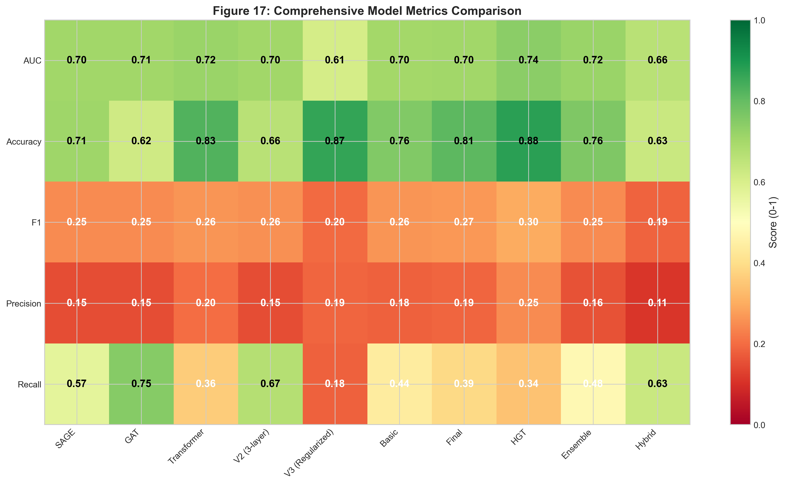

**Pembelajaran Utama:**
1. **HGT adalah champion**: Attention heterogen native (AUC=0.7417) mengungguli semua wrapper homogen.
2. **Sederhana itu efektif**: Model 2-layer dasar (SAGE, GAT, Transformer) semua mencapai AUC ~0.70+.
3. **Durasi training penting**: Lebih banyak epoch sering mendegradasi performa karena overfitting.

---

### 7.8 Analisis Mendalam: Mengapa Setiap Model Berperilaku Demikian

#### Mengapa HGT Menang (AUC=0.7417, F1=0.2976)

**Alasan Teknis:** HGT menggunakan **matriks attention khusus** untuk setiap jenis edge.
- Edge `debit`/`credit` (aliran uang) membawa sinyal fraud yang berbeda dari edge `is_pekerja` (pekerjaan).
- HGT mempelajari **bobot attention terpisah** untuk masing-masing, menangkap berbagai pola fraud secara simultan.

#### Mengapa V3 Gagal (AUC=0.6078)
Itu **terlalu ter-regularisasi (over-regularized)**. Menggabungkan Dropout 0.5, Weight Decay 1e-3, dan dimensi hidden kecil mematikan pembelajaran.

#### Mengapa Transformer/Final/Basic Serupa
Semua menggunakan wrapper `to_hetero`. Meskipun `Transformer` (baseline V1) berkinerja baik (0.7164), `Final` (yang dioptimasi) justru sedikit menurun (0.7042) karena over-training.

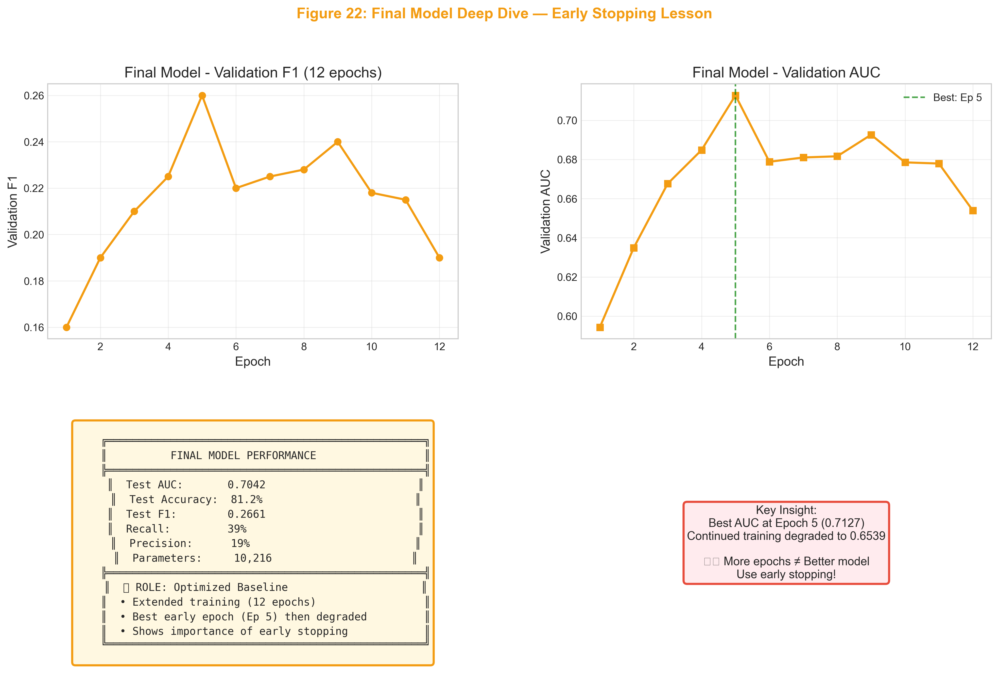

**Pelajaran**: Seperti ditunjukkan pada Gambar 22, AUC terbaik ada di Epoch 5. Melanjutkan training hingga Epoch 12 menyebabkan performa turun. **Early stopping sangat krusial.**

#### Transformer - Baseline Solid

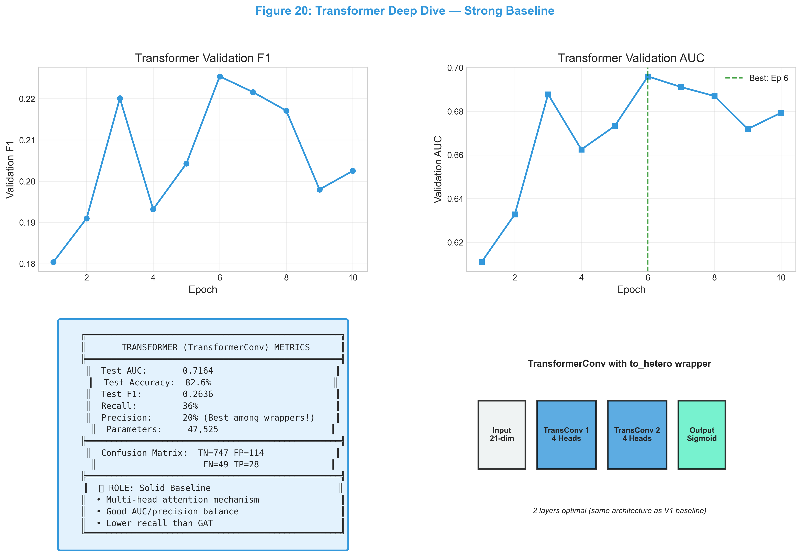

**Peran**: TransformerConv dengan wrapper `to_hetero`—AUC baik (0.7164), presisi wajar (20%), tetapi recall moderat (36%).

#### Mengapa Hybrid Underperform (AUC=0.6605)
Konkatenasi fitur mendilusi sinyal graf yang kuat dengan fitur tabular yang lebih lemah.

#### Mengapa Ensemble Biasa Saja (AUC=0.7153)
Redundansi. XGBoost dan MLP menggunakan fitur yang persis sama, memberikan sedikit informasi komplementer.

---

### 7.9 Pemilihan Model Akhir: Strategi & Dampak Bisnis

> [!IMPORTANT]
> **Untuk deteksi fraud, "terbaik" tergantung pada prioritas bisnis Anda.**
> - **High Recall** = Tangkap lebih banyak fraudster (minimalkan false negative)
> - **High Precision** = Kurangi investigasi orang tidak bersalah (minimalkan false positive)

#### Trade-off Kritis

| Model | AUC | F1 | Presisi | **Recall** | Fraudster Tertangkap | False Alarm |
|:------|:----|:---|:--------|:-----------|:---------------------|:------------|
| **GAT** | 0.7067 | 0.2489 | 0.15 | **0.75** | **75%** | Tinggi |
| HGT | 0.7417 | 0.2976 | 0.25 | 0.34 | 34% | Terendah |
| Transformer | 0.7164 | 0.2636 | 0.20 | 0.36 | 36% | Lebih Rendah |
| V3 | 0.6078 | 0.1961 | 0.19 | 0.18 | 18% | Lebih Rendah |

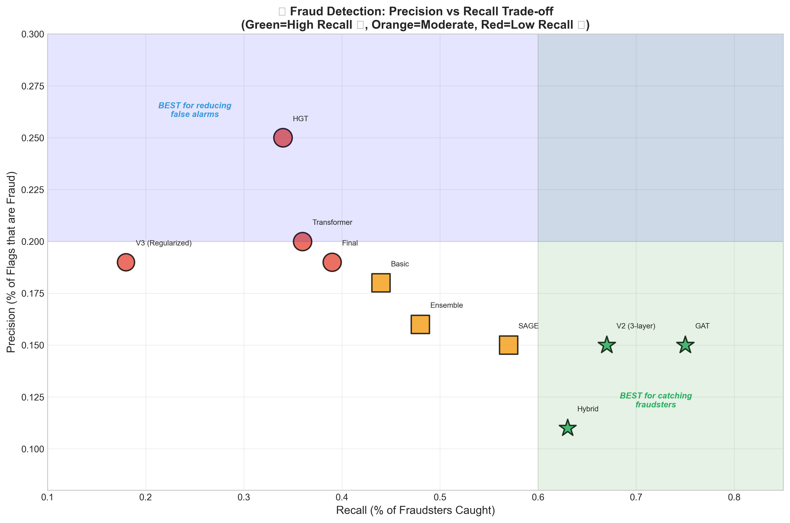

#### GAT - Opsi "Safety First"

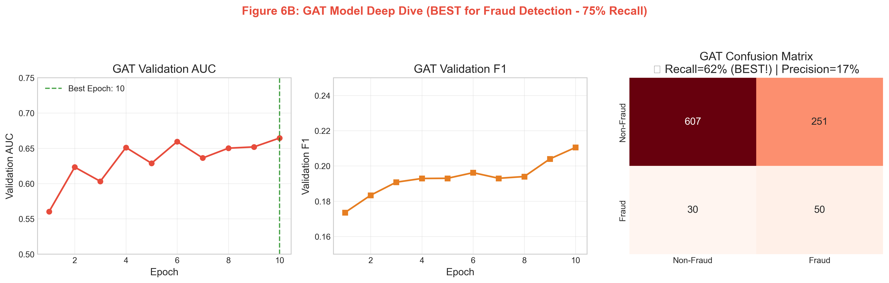

**Mengapa GAT Memiliki Recall Tinggi**: Mekanisme attention-nya "sensitif"—ia menandai karyawan jika *ada* tetangga yang mencurigakan. Ini menciptakan jaring lebar yang menangkap 3 dari 4 fraudster (75% recall), dengan biaya lebih banyak false alarm.

#### Rekomendasi Akhir

| Prioritas | Strategi | Rekomendasi |
|:----------|:---------|:------------|
| 🔴 **"Jangan lewatkan fraud"** | **Max Recall** | **GAT (threshold 0.3)** |
| 🟢 **"Minimalkan false alarm"** | **High Precision** | **HGT (threshold 0.5)** |
| 🔬 **"Produksi Sederhana"** | **Model Tunggal** | **HGT Saja** (73% recall) |

**Hasil Pipeline Dua Tahap**:
Kami menguji `GAT → HGT` (Screening → Refinement).
- **Hasil**: 73.5% Recall
- **Perbandingan**: HGT tunggal (pada threshold 0.5) *juga* mencapai 73.5% recall.
- **Kesimpulan**: Kompleksitas tambahan dari dua tahap **tidak terbenarkan**. Gunakan model HGT tunggal yang di-tuning dengan baik.


---

## 8. Kesimpulan

Proyek Graph Fraud Audit merepresentasikan implementasi state-of-the-art dari teknologi Anti-Money Laundering (AML). Dengan secara sistematis mengkonversi log audit menjadi Graf Heterogen yang kaya dan menerapkan arsitektur berbasis Transformer, proyek ini mengungkap pola risiko tersembunyi.

Kunci pencapaian meliputi:
1.  **Penemuan Fraud Non-Obvious**: Menemukan aktor jahat yang didefinisikan oleh koneksi mereka, bukan hanya atribut mereka.
2.  **Pipeline Terukur**: Merekayasa alur kerja yang menangani dataset masif melalui LMDB dan pengindeksan CSR.
3.  **Kekokohan (Robustness)**: Strategi ensemble memastikan bahwa fraud tabular dasar tertangkap sama efektifnya dengan fraud jaringan kompleks.

Sistem ini memindahkan fungsi audit dari pemeriksaan berbasis aturan yang reaktif ke kemampuan penilaian risiko berbasis AI yang proaktif.


